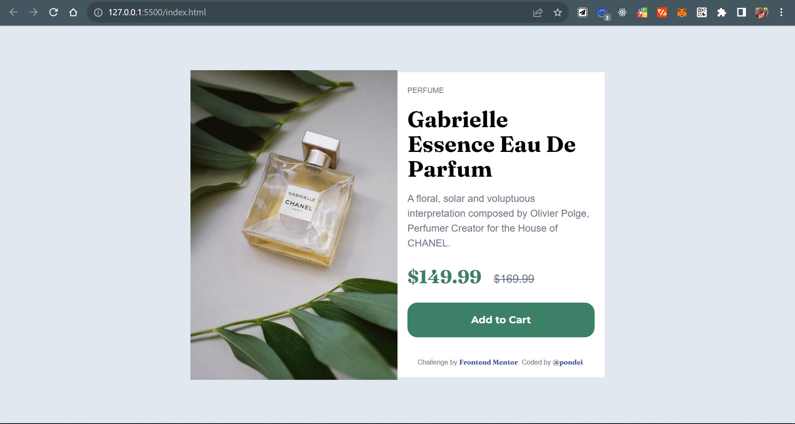

# Frontend Mentor - Product preview card component solution

This is a solution to the [Product preview card component challenge on Frontend Mentor](https://www.frontendmentor.io/challenges/product-preview-card-component-GO7UmttRfa). 

## Table of contents

- [Overview](#overview)
  - [The challenge](#the-challenge)
  - [Screenshot](#screenshot)
  - [Links](#links)
- [My process](#my-process)
  - [Built with](#built-with)
  - [What I learned](#what-i-learned)
  - [Continued development](#continued-development)
- [Author](#author)

## Overview

### The challenge

Users should be able to:

- View the optimal layout depending on their device's screen size
- See hover and focus states for interactive elements

### Screenshot

### Links

- Solution URL: [Github](https://github.com/Ebimo21/product-preview-card-component-main)
- Live Site URL: [Vercel](https://product-preview-card-component-vanilla.vercel.app/)

## My process

### Built with

- Semantic HTML5 markup
- Flexbox
- Mobile-first workflow
- [TailwindCSS](https://tailwindcss.com/) - For css styling

### What I learned

I learnt to set up Tailwind in a plain HTML file.

### Continued development

Having used Tailwind extensively in react projects, it fun to implement same in a vanilla html project

## Author

- Ebimobowei Pondei
- Frontend Mentor - [@ebimo21](https://www.frontendmentor.io/profile/ebimo21)
- Twitter - [@ebimopondei](https://www.twitter.com/ebimopondei)
